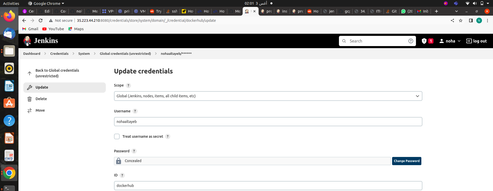
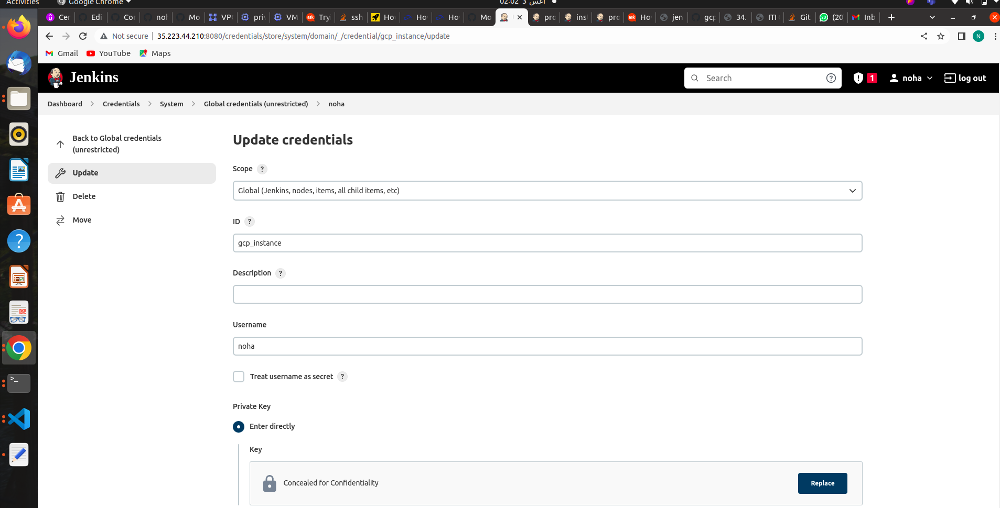
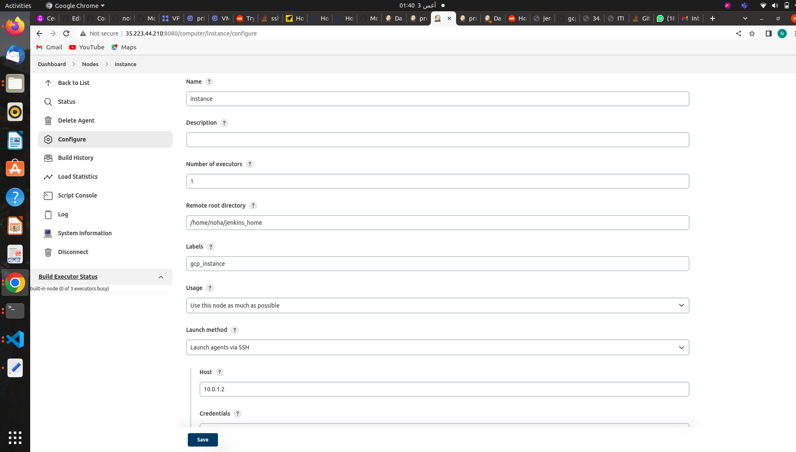
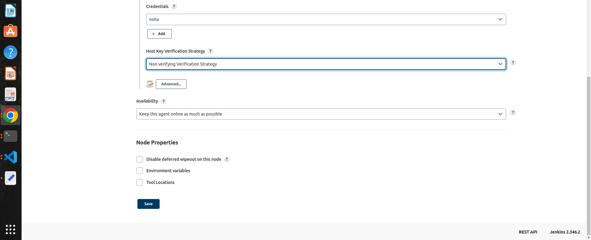
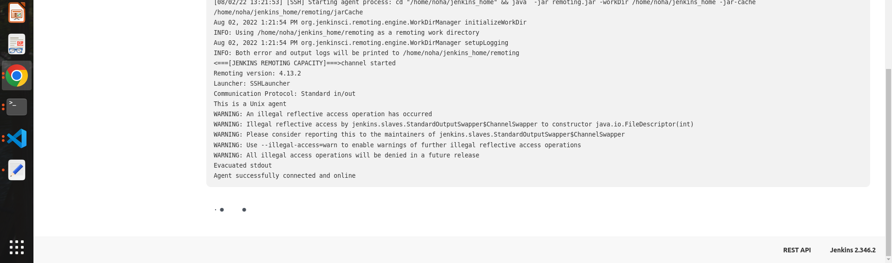
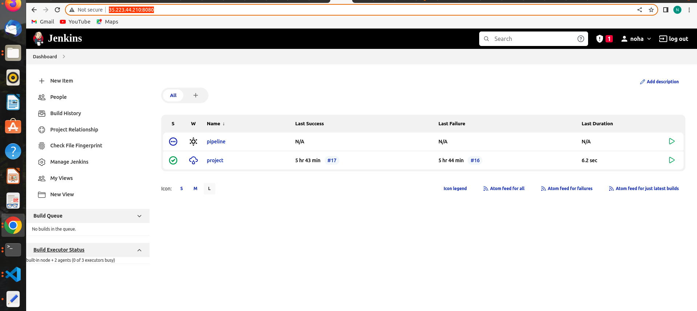
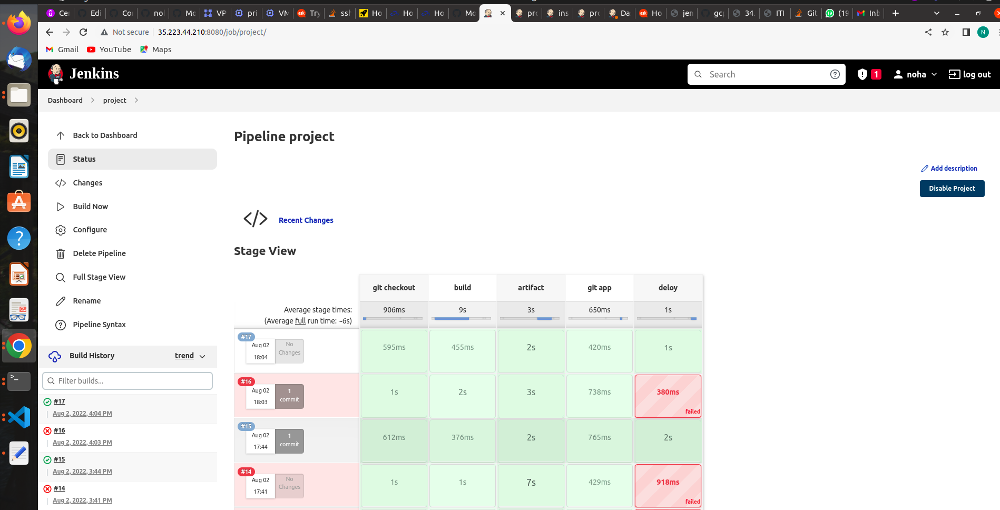
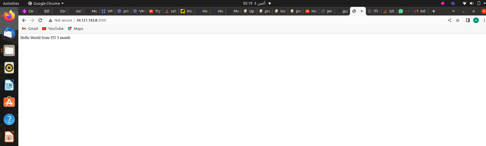

# ITI-Final-App

## For my pipeline I have followed the next steps:

# 1-Adding Credentials:

- for Docker hub we need to login before pushing the application image.

 

 

- to ssh  to the  VM

## 2-Downloading packages inside the vm to use kubectl.

1- openjdk = > following these steps :  [https://www.cloudbooklet.com/how-to-install-java-on-google-cloud-ubuntu-18-04-lts/](https://www.cloudbooklet.com/how-to-install-java-on-google-cloud-ubuntu-18-04-lts/)

2- gcloud   ⇒

3- kubectl  ⇒

4- docker ⇒ 

             

              -change permission for docker daemon.

5-git   

## 3-Configuring VM instance to work as a slave

## 4-Building Jenkins pipeline to deploy our app on the GKE Infrastructure :

link of infrastructure  ⇒ ‣

and here is our deployed nodejs application 🥳

